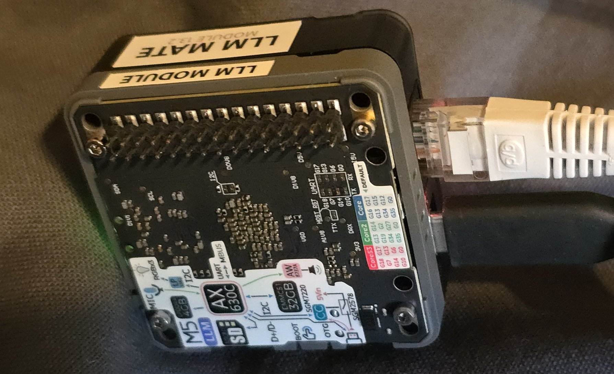
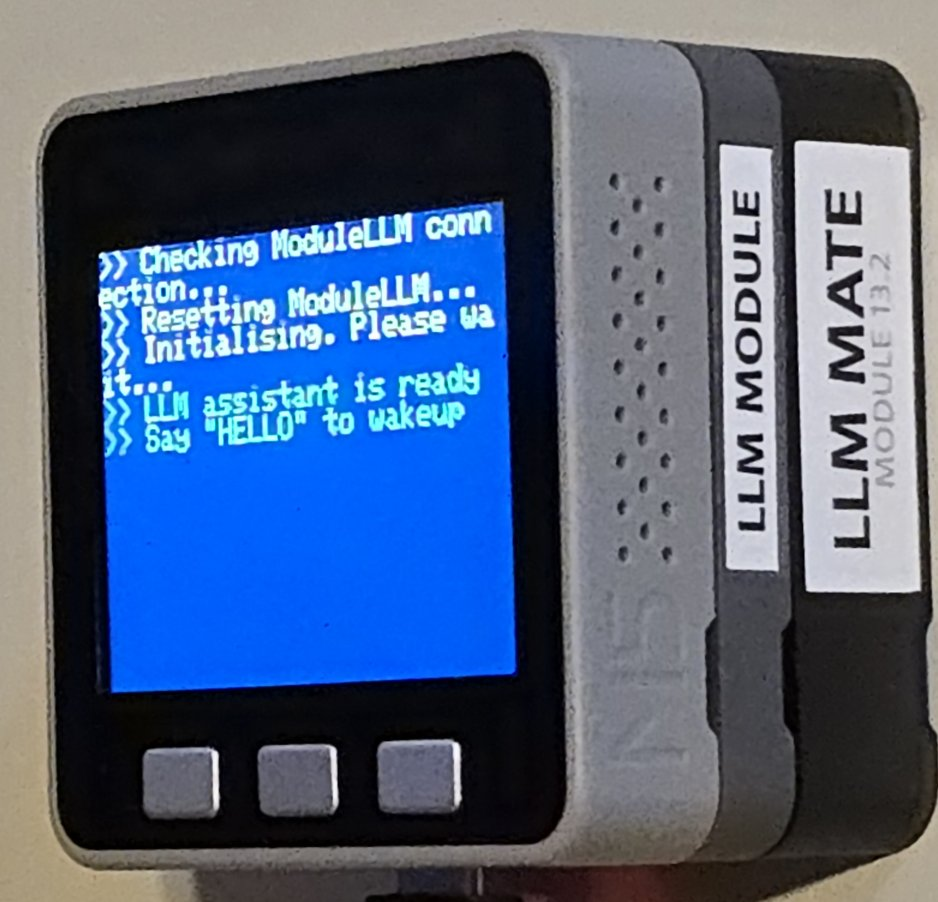
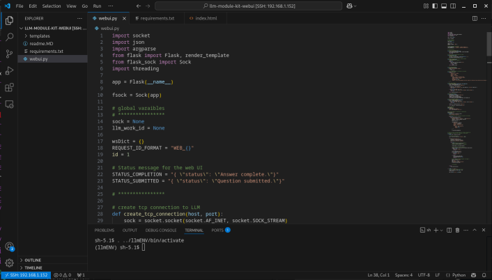
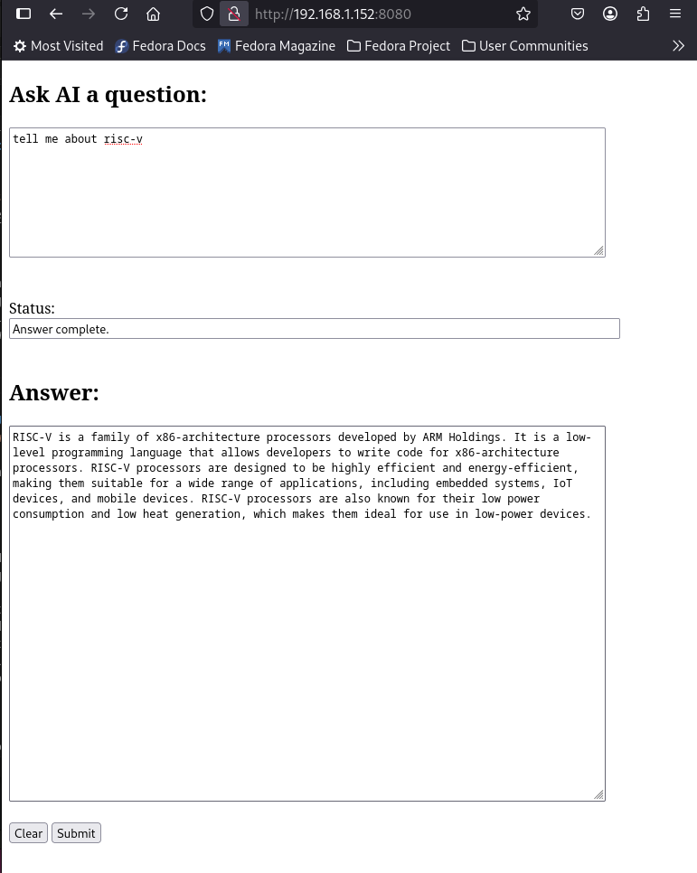

# llm-module-kit-webui
A web UI for M5Stack's LLM Module Kit without using a M5Stack Controller.<b>

## 1. Introduction 
In my previous video, I showed you how to add a web user interface to interact with a LLM model using Arduino on a M5Stack core controller stacked on top of the LLM Module Kit.
 This time I am showing you how to build a web UI running natively on the LLM Module Kit without a M5Stack controller. In other words, you can do it just using the LLM Module Kit alone. And it will have the same web UI which you saw in my previous video.

Comparing the 2 photos and you will see that the M5Stack controller has been removed from the LLM Module Kit this time.

The programming environment I use this time is not Arduino. I am using Python3 and its flask and flask-sock modules. The web UI looks exactly the same as before with minor enhancements: the 'clear' and 'submit' buttons are now disabled when you click on 'submit' and re-eanabled when the LLM completes its response.

# 2. Tools and Environment Setup
The tools and environment setup include:
1. VSCode
2. The LLM Module Kit's Ubuntu environment Setup

## 2.1  VSCode
 Install VSCode on your laptop where you are going to do your development and not on the LLM Module Kit. At a minimum, you need to install VSCode and the Remote Development extension. They allow you to edit the code remotely on your laptop using ssh behind the scene.
    *** Please note that you don't have to do this if you just want to run webUI and not doing any development.  ***
    I am not going to describe how to install VSCode and the Remote Development extension. For those who want to install them, just Google it and you will find plenty of detailed instructions. 

 

## 2.2  The LLM Module Kit's Ubuntu environment Setup
The Ubuntu OS preinstalled on the LLM Module Kit is a cut down version of Ubuntu 22.04 LTS.
 It comes with only one user: root. Using root all the time is not a good practice. Therefore, I created a normal user account and use it for development.
 The LLM Module Kit does not come with Wifi. You have to connect an Ethernet cable from your router/switch to the LLM Module Kit's Ethernet port and ssh in as root to set it up (its default password is '123456'):
<pre>
# set up a new user
useradd -m -g users <b><i>username</i></b>
passwd <b><i>username</i></b>

# link python3 and python allowing
# just typing python to invoke the preinstalled Python 3.10.12
ln -s /usr/bin/python3 /usr/bin/python

# Allow the new user to use sudo
usermod -aG sudo <b><i>username</i></b>
chmod 4755 /usr/bin/sudo

</pre>
Log out as root, then log back in as the new user. Now clone my Github repo and set up a virtual environment to run the webui.
<pre>
# clone my repo
git clone https://github.com/AndyYuen/webui-llm-module-kit.git
cd webui-llm-module-kit

# install/setup a virtual environment
pip install virtualenv
python -m virtualenv llmENV
source llmENV/bin/activate

pip install -r requirements.txt
</pre>
And now, you can start the webui:
<pre>
python webui.py
</pre>

## 4. Using the Web UI
The web UI is created using html and Javascript hosted on the flask web application webui.py. The clients and server use websockets for communication
To access the webui, just point your browser to: http://<b><i>llmModuleKitIPAddress</i></b>:8080

## 4. More Information on the WebUI
You maybe interested to know some facts on the WebUI:
* it is a Python flask application
* it uses the flask-sock module to handle websockets for communication between webui.py and its web clients
* it uses a separate thread to interact with the local LLM model using a normal socket
* when webui.py receives a question from a web client for the LLM model from a web client, it generates a unique Id and uses it as the request_id in an inference call to the LLM model. It also uses this unique Id as key and saves the ws (web socket) object as value in a dictionary. When webui.py receives an inference response, it retrieves the request_id from the response and uses it as a key to retrieve the ws object and sends the the response back to the web client. It may take many partial responses to complete the response. The final response is indicated by the 'finish: true' element in the response.

## 5. Conclusions
My webui.py flask application allows you to interact with the LLM model on the LLM Module Kit obviating the need for use of a M5Stack controller unlike my previous Arduino webui.
 If you have just taken delivery of the LLM Module Kit and realise that you forgot to purchase a supported M5Stack controller, you can still use webui.py to ask the LLM model questions using a browser.
 By experimenting on the LLM Module Kit's Ubuntu OS, you learn more about it. And you may be able to add other useful capabilities to enhance the LLM Module Kit.

I hope you find this Github project useful.
